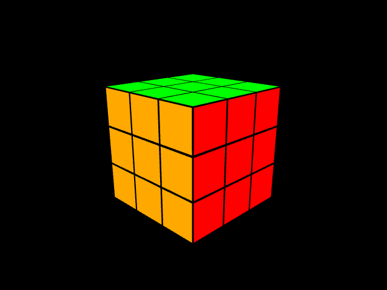

# OpenGLGame
Building a simple game using OpenGL for graphics to learn the basics. 

8/19:
- Created a project using GLEW and GLFW. 
- Created a window
- Created a shader and rendered a rectangle

9/1:
- Set up camera view
- Created cube class
- Rendering a Rubik's cube